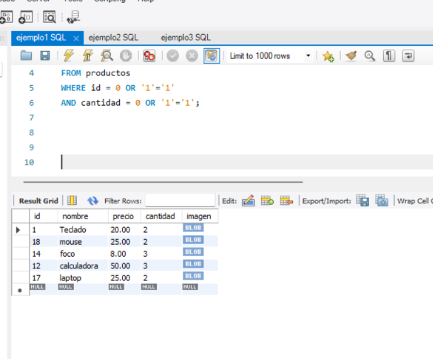
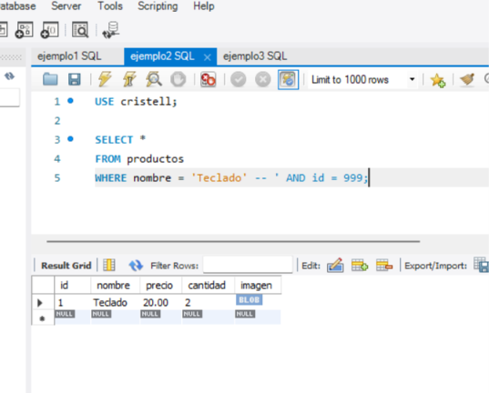
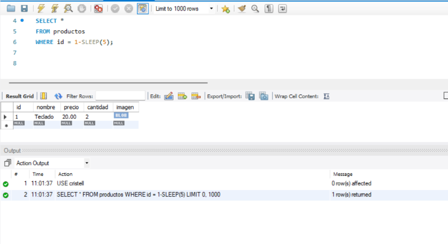
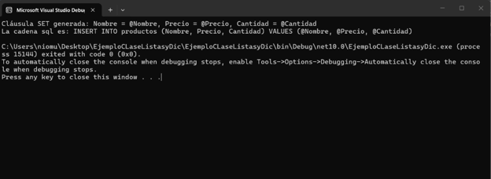
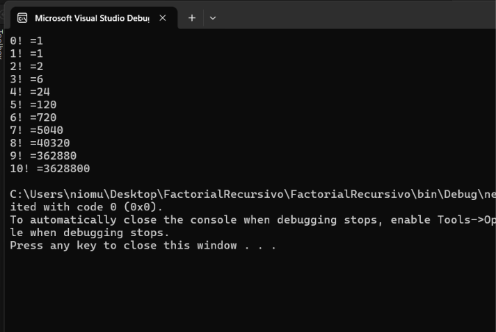
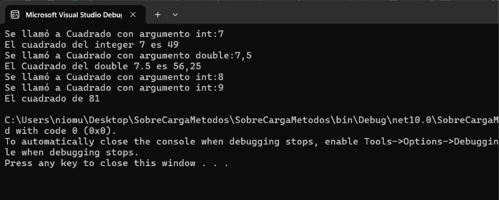

# Laboratorio-Repaso-del-CRUD-M-todos-Sobrecargados

## 🟥PROBLEMA 1 – Ejemplos de Inyección SQL
En este problema se desarrollaron **tres ejemplos de consultas SQL** para comprender de forma práctica cómo funciona una vulnerabilidad de **Inyección SQL**.

La inyección SQL ocurre cuando una consulta permite que ciertos valores introducidos sean interpretados como parte del código SQL y no solamente como datos. Esto puede cambiar la lógica original de la consulta, permitir consultar información que normalmente no debería mostrarse o incluso aprovechar el comportamiento de la base de datos para obtener información indirectamente.

Los tres ejemplos realizados fueron:

- Manipulación de condiciones mediante `OR '1'='1'`.
- Uso de comentarios `--` para ignorar parte de una consulta.
- Inyección basada en tiempo utilizando `SLEEP()`.


### Ejemplo 1 – Manipulación de la condición con `OR '1'='1'`
### Código utilizado
```sql
USE cristell;

SELECT * 
FROM productos
WHERE id = 0 OR '1'='1'
AND cantidad = 0 OR '1'='1';
```

### Explicación

En este primer ejemplo se utiliza la condición:

```sql
'1'='1'
```

Esta comparación siempre devuelve **verdadero**, ya que el valor `1` es igual a `1`.

El objetivo es demostrar cómo una condición agregada mediante `OR` puede modificar completamente la lógica original de un `WHERE`.

Aunque inicialmente se intenta buscar productos con:

```sql
id = 0
```

y:

```sql
cantidad = 0
```

también se agregan condiciones como:

```sql
OR '1'='1'
```

Al utilizar `OR`, basta con que una de las condiciones sea verdadera para que la expresión completa pueda cumplirse.

Por esta razón, la consulta puede terminar mostrando varios o incluso todos los registros de la tabla `productos`, aunque los valores originales de `id` o `cantidad` no coincidan.

Este ejemplo representa una **Inyección SQL basada en lógica booleana**.


### Imagen de ejecución



### Ejemplo 2 – Uso de comentarios para ignorar parte de la consulta

### Código utilizado

```sql
SELECT *
FROM productos
WHERE nombre = 'Teclado' -- ' AND id = 999;
```

### Explicación

En este ejemplo se utiliza el símbolo:

```sql
--
```

En SQL, los dos guiones representan el inicio de un **comentario de una sola línea**.

Esto significa que todo lo que aparece después de `--` deja de ser interpretado como parte de la consulta SQL.

En este caso tenemos:

```sql
WHERE nombre = 'Teclado' -- ' AND id = 999;
```

La parte:

```sql
' AND id = 999;
```

queda ignorada por la base de datos.

Por lo tanto, la consulta termina funcionando prácticamente como:

```sql
SELECT *
FROM productos
WHERE nombre = 'Teclado';
```

La condición `id = 999` ya no es tomada en cuenta.


### Imagen de ejecución



### Ejemplo 3 – Inyección SQL basada en tiempo

### Código utilizado

```sql
USE cristell;

SELECT *
FROM productos
WHERE id = 1-SLEEP(5);
```

### Explicación

En este ejemplo se utiliza la función:

```sql
SLEEP(5)
```

Esta función hace que MySQL espere aproximadamente **5 segundos** antes de continuar con la ejecución de la consulta.

La condición utilizada es:

```sql
WHERE id = 1-SLEEP(5);
```

Primero se ejecuta:

```sql
SLEEP(5)
```

Después de esperar los 5 segundos, la función normalmente devuelve `0`.

Por lo tanto, la expresión termina siendo equivalente a:

```sql
id = 1 - 0
```

es decir:

```sql
id = 1
```

La consulta termina buscando el producto con `id = 1`, pero antes de mostrar el resultado se produce un retraso intencional.

Este comportamiento permite explicar un tipo de vulnerabilidad conocido como **Time-Based SQL Injection** o **Inyección SQL basada en tiempo**.

En este tipo de ataque no siempre se obtiene información directamente en pantalla. En cambio, se analiza cuánto demora la base de datos en responder.


### Imagen de ejecución



## Conclusión del Problema 1
Con los tres ejemplos realizados se pudieron observar diferentes formas en las que una consulta SQL puede ser manipulada:

1. **`OR '1'='1'`** permite alterar la lógica de una condición y hacer que esta siempre resulte verdadera.
2. **`--`** permite convertir una parte de la consulta en comentario e ignorar condiciones posteriores.
3. **`SLEEP()`** permite provocar un retraso intencional en la consulta y demostrar una inyección basada en tiempo.

Estos ejemplos muestran por qué es importante evitar construir consultas SQL concatenando directamente los datos ingresados por el usuario.

Una de las principales formas de prevención es utilizar **consultas preparadas y parametrizadas**, ya que permiten que los valores ingresados sean tratados como datos y no como instrucciones SQL.

---

## 🟥PROBLEMA 2 – Uso de Dictionary, List y generación dinámica de SQL
En este problema se trabajó con un `Dictionary<string, object>` para almacenar información de un producto y posteriormente utilizar sus claves para construir de forma dinámica partes de una consulta SQL.

Los temas principales trabajados fueron:

- Uso de `Dictionary<string, object>`.
- Uso de la propiedad `.Keys`.
- Recorrido de colecciones mediante `foreach`.
- Uso de `List<string>`.
- Uso de `string.Join()`.
- Creación dinámica de columnas y parámetros.
- Construcción de una sentencia `INSERT INTO`.


### Explicación

#### 1. Creación del diccionario

Se crea un `Dictionary<string, object>` llamado `datosInventario`, donde cada dato se guarda como una relación **clave-valor**:

```text
Nombre -> Laptop HP Envy
Precio -> 850.99
Cantidad -> 15
```

Se usa `object` porque los valores pueden ser de distintos tipos, como `string`, `decimal` o `int`.


#### 2. Creación de la lista `setParts`
```csharp
var setParts = new List<string>();
```

Esta lista se utiliza para guardar expresiones como:

```text
Nombre = @Nombre
Precio = @Precio
Cantidad = @Cantidad
```


#### 3. Uso de `.Keys` y `foreach`
```csharp
foreach (var key in datosInventario.Keys)
{
    setParts.Add($"{key} = @{key}");
}
```

`.Keys` obtiene las claves del diccionario, es decir:

```text
Nombre
Precio
Cantidad
```

El `foreach` las recorre una por una y crea automáticamente las expresiones con sus respectivos parámetros.

#### 4. Uso de `string.Join()`
```csharp
string setClause = string.Join(", ", setParts);
```

`string.Join()` une los elementos de la lista en una sola cadena:

```text
Nombre = @Nombre, Precio = @Precio, Cantidad = @Cantidad
```

Esto permite generar de forma dinámica una cláusula que podría utilizarse en un `UPDATE`.


#### 5. Creación de columnas y parámetros
```csharp
var columns = string.Join(", ", datosInventario.Keys);
var placeholders = "@" + string.Join(", @", datosInventario.Keys);
```

Se generan automáticamente:

```text
Columnas:
Nombre, Precio, Cantidad

Parámetros:
@Nombre, @Precio, @Cantidad
```


#### 6. Construcción de la sentencia SQL
```csharp
string sql = $"INSERT INTO productos ({columns}) VALUES ({placeholders})";
```

El resultado final es:

```sql
INSERT INTO productos (Nombre, Precio, Cantidad)
VALUES (@Nombre, @Precio, @Cantidad)
```

La consulta se construye automáticamente a partir de las claves del diccionario, sin escribir manualmente cada columna.


## Imagen de ejecución



## Conclusión del Problema 2
En este problema se practicó el uso conjunto de **diccionarios, listas, ciclos `foreach` y `string.Join()`**.

El `Dictionary<string, object>` permitió almacenar los datos del producto utilizando los nombres de las columnas como claves. Posteriormente, `.Keys` permitió obtener esas claves y utilizarlas para generar automáticamente tanto una cláusula `SET` como una sentencia `INSERT INTO`.Con este ejemplo se puede comprender cómo estas estructuras permiten crear código más flexible y reutilizable al momento de trabajar con operaciones CRUD y consultas SQL.

---

## 🟥PROBLEMA 3 – Recursividad con el cálculo del factorial

En este problema se trabaja el concepto de **recursividad**, utilizando un método llamado `Factorial()` que se llama a sí mismo para calcular el factorial de un número.

Según la teoría vista en clase, un método recursivo es aquel que se llama a sí mismo de forma directa o indirecta. Para que funcione correctamente, debe existir un **caso base** que permita detener las llamadas recursivas.

### Conceptos importantes

#### Método recursivo

El método utilizado es:

```csharp
public static long Factorial(long numero)
```

Este método recibe un número y calcula su factorial.

La parte principal de la recursividad ocurre en:

```csharp
return numero * Factorial(numero - 1);
```

Aquí el método vuelve a llamarse a sí mismo, pero cada vez con un número menor.

Por ejemplo:

```text
5! = 5 × 4 × 3 × 2 × 1
```

La idea es ir reduciendo el problema hasta llegar al caso más sencillo.

#### Caso base

```csharp
if (numero <= 1)
    return 1;
```

El **caso base** permite detener la recursividad.

Cuando el número llega a `1` o `0`, el método devuelve `1` y deja de llamarse a sí mismo.

#### Paso de recursividad

```csharp
return numero * Factorial(numero - 1);
```

Este es el **paso recursivo**, porque el método vuelve a llamarse con una versión más pequeña del problema.

Cada llamada disminuye el valor de `numero` en `1` hasta llegar al caso base.

#### Uso del ciclo `for`

En el método `Main` se utiliza un ciclo:

```csharp
for (long contador = 0; contador <= 10; contador++)
```

Este ciclo permite calcular y mostrar en consola los factoriales desde `0` hasta `10`.

La variable `contador` solo existe dentro del alcance del ciclo `for`.


### Imagen de ejecución



### ¿Qué demuestra este problema?

Este problema permite comprender cómo funciona un **método recursivo**, identificando sus dos partes principales:

- **Caso base:** detiene la recursividad.
- **Paso recursivo:** vuelve a llamar al mismo método con un problema más pequeño.

De esta forma, el programa puede resolver el cálculo del factorial reutilizando el mismo método hasta llegar al caso base.

---

## 🟥PROBLEMA 4 – Métodos Sobrecargados

En este problema se trabaja el concepto de **sobrecarga de métodos**, utilizando dos métodos llamados `Cuadrado()` que tienen el mismo nombre, pero reciben diferentes tipos de parámetros.

Según la teoría vista en clase, un método puede tener el mismo nombre que otro siempre que cambie su **firma**, es decir, el número, tipo u orden de los parámetros. El compilador identifica cuál método debe ejecutar según el argumento que recibe. :chatgpt-content-reference{index="0"}

### Conceptos importantes

#### Sobrecarga de métodos

En la clase `SobreCarga` existen dos versiones del método `Cuadrado()`:

```csharp
public int Cuadrado(int valorInt)
```

y:

```csharp
public double Cuadrado(double valorDouble)
```

Ambos métodos tienen el mismo nombre, pero reciben parámetros diferentes:

```text
Cuadrado(int)
Cuadrado(double)
```

Esto es lo que permite que exista la sobrecarga.

#### Firma del método

La diferencia entre los métodos sobrecargados se encuentra en su **firma**, que está formada por el nombre del método y sus parámetros.

En este caso:

```text
Cuadrado(int)
Cuadrado(double)
```

Aunque tengan el mismo nombre, el compilador puede diferenciarlos por el tipo de dato recibido. :chatgpt-content-reference{index="1"}

#### Selección automática del método

Cuando se llama:

```csharp
Cuadrado(7)
```

el valor `7` es un entero, por lo tanto se ejecuta:

```csharp
public int Cuadrado(int valorInt)
```

En cambio, cuando se llama:

```csharp
Cuadrado(7.5)
```

se utiliza la versión que recibe un `double`:

```csharp
public double Cuadrado(double valorDouble)
```

El compilador selecciona automáticamente el método adecuado según el tipo del argumento.

#### Uso de la clase en `Program`

En el programa principal se crea una instancia de la clase:

```csharp
SobreCarga varSobreCarga = new SobreCarga();
```

Luego se utiliza el objeto `varSobreCarga` para llamar a los métodos de la clase:

```csharp
varSobreCarga.ProbarMetodosSobreCargados();
```

También se puede llamar directamente al método `Cuadrado()`:

```csharp
varSobreCarga.Cuadrado(8);
```

y:

```csharp
varSobreCarga.Cuadrado(9);
```

Como `8` y `9` son enteros, en ambos casos se utiliza la versión que recibe un parámetro `int`.

### Imagen de ejecución



### ¿Qué demuestra este problema?

Este problema demuestra cómo la **sobrecarga de métodos** permite utilizar un mismo nombre para realizar una operación similar con diferentes tipos de datos.

En este caso, `Cuadrado()` puede trabajar tanto con valores `int` como con valores `double`, y C# selecciona automáticamente la versión correcta según el argumento utilizado.
